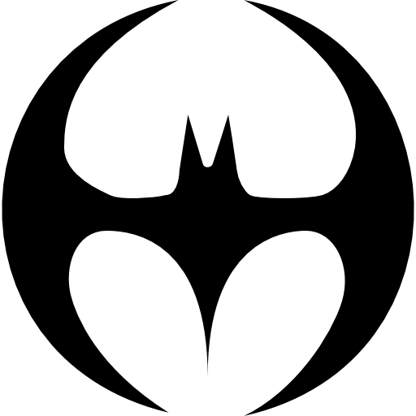
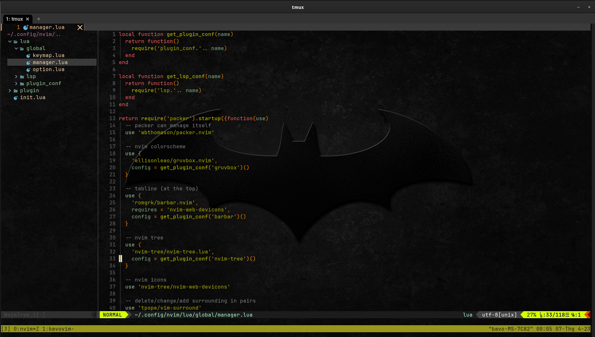

# bavovim
My custom vim's settings. Currently support Linux and MacOS.


## 1. Prerequisites
- See [prerequisite.md](./docs/prerequisite.md)
## 2. Installation 
### Run the following command:
```bash
bash install.sh -p -n
```
### If you only want to update local neovim:
```bash
bash install.sh -n
```
### To also install the nvim heap guard (auto-restarts nvim panes that have gone stale for 14+ days or grown past 1.5GB, releasing the heap macOS parks in swap — skips any pane with unsaved buffers):
```bash
bash install.sh -n -g
```
See [nvim_heap_guard.sh](./scripts/nvim_heap_guard.sh) — logs to `~/.cache/nvim_heap_guard.log`.

## 2. Useful mappings
- See [useful_mappings.md](./docs/useful_mappings.md)

