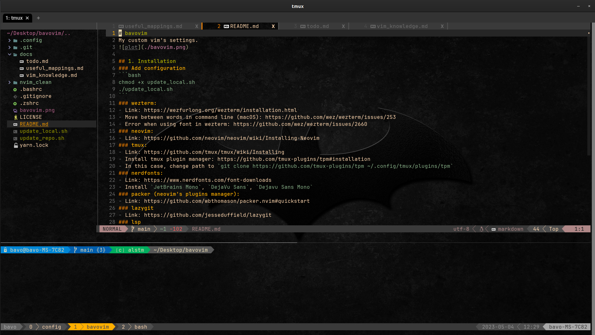

# bavovim
My custom vim's settings.


## 1. Installation 
### Add configuration
```bash
chmod +x update_local.sh
./update_local.sh
```
### wezterm: 
- Link: https://wezfurlong.org/wezterm/installation.html (install .deb file)
- Move between words in command line (macOS): https://github.com/wez/wezterm/issues/253
- Error when using font in wezterm: https://github.com/wez/wezterm/issues/2660
### neovim: 
- Link: https://github.com/neovim/neovim/blob/master/INSTALL.md#appimage-universal-linux-package
- ```bash
  curl -LO https://github.com/neovim/neovim/releases/latest/download/nvim.appimage
  chmod u+x nvim.appimage
  mkdir -p /opt/nvim
  mv nvim.appimage /opt/nvim/nvim
  ```
### tmux: 
- Link: https://github.com/tmux/tmux/wiki/Installing
- Install tmux plugin manager: https://github.com/tmux-plugins/tpm#installation
- In this case, change path to `git clone https://github.com/tmux-plugins/tpm ~/.config/tmux/plugins/tpm`
### nerdfonts: 
- Link: https://www.nerdfonts.com/font-downloads
- Install `JetBrains Mono`, `DejaVu Sans`, `Dejavu Sans Mono`
### lazy.nvim (plugin manager)
https://github.com/folke/lazy.nvim?tab=readme-ov-file#-installation
### lazygit
- Link: https://github.com/jesseduffield/lazygit
### lsp
- Server configuration for lspconfig: https://github.com/neovim/nvim-lspconfig/blob/master/doc/server_configurations.md
- Use mason to install LSP servers and setup via lspconfig file. Currently lsp servers: 'pyright', 'lua_ls', 'bashls'
### ripgrep (for telescope)
- Link: https://github.com/BurntSushi/ripgrep
### color in neovim
- Change color in [gruvbox](./.config/)
### For macOS only
- Install oh-my-zsh: https://ohmyz.sh/#install 
- Activate anaconda after installing oh-my-zsh: https://stackoverflow.com/questions/40370467/anaconda-not-found-in-zsh
- Install xcode: `xcode-select --install`
### For Linux only
- Install oh-my-bash: https://github.com/ohmybash/oh-my-bash#basic-installation

## 2. Useful mappings
- See [useful_mappings.md](./docs/useful_mappings.md)

